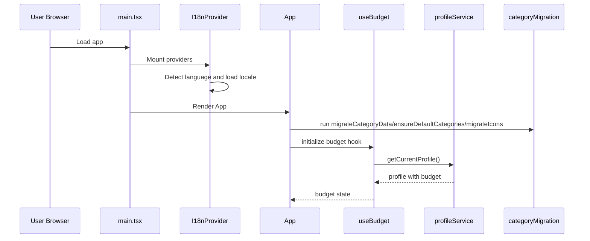
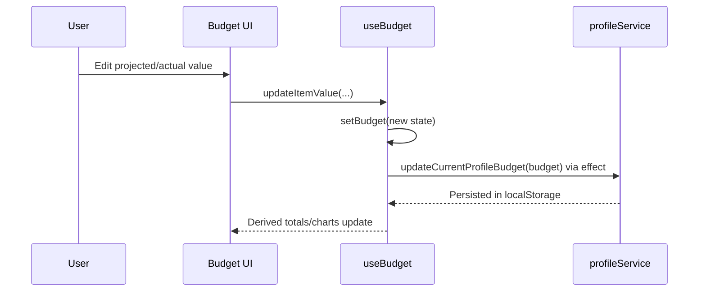
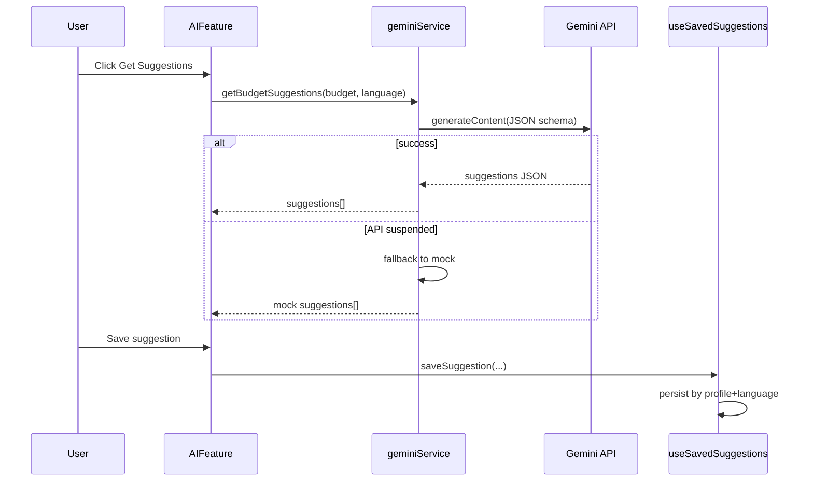
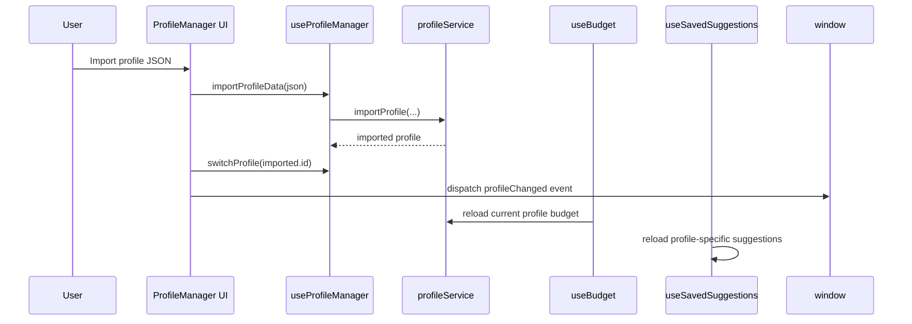
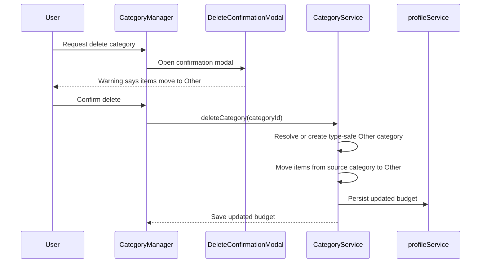

# F. Critical Flows

## Flow 1: Application startup and budget bootstrap

### Evidence
- main.tsx provider bootstrap: src/main.tsx
- startup migration calls and App orchestration: src/App.tsx
- budget initialization and profile-first load: src/hooks/useBudget.ts
- migration functions: src/utils/categoryMigration.ts

## Flow 2: Update budget item value

### Evidence
- state mutation and persistence effect: src/hooks/useBudget.ts
- total calculations in App: src/App.tsx

## Flow 3: Generate AI suggestions

### Evidence
- AI UI trigger and save operations: src/components/features/AIFeature.tsx
- Gemini contract and fallback: src/services/geminiService.ts
- saved suggestion persistence: src/hooks/useSavedSuggestions.ts

## Flow 4: Profile import and switch

### Evidence
- profile management operations: src/components/features/ProfileManager.tsx
- profile import/export and current profile switch: src/services/profileService.ts
- budget/profileChanged reaction: src/hooks/useBudget.ts
- suggestion reload hooks: src/hooks/useSavedSuggestions.ts

## Flow 5: Category deletion

### Observation
- Flow is now aligned with the warning copy: items are preserved and moved to Other before deletion.

### Evidence
- warning message in modal and i18n text: src/components/features/DeleteConfirmationModal.tsx, src/i18n/locales/en.json
- actual delete behavior: src/services/categoryService.ts
- hook-level state refresh after delete: src/hooks/useCategories.ts
