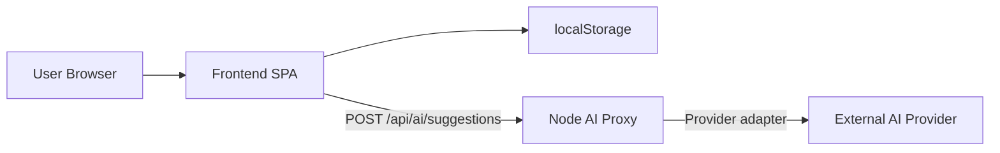
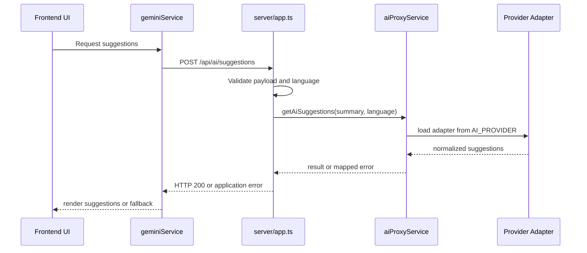

# System Design

This is the canonical architecture guide for the Family Budget App. It owns the runtime boundary between the frontend in `src/` and the backend AI proxy in `server/`.

## Navigation

- Previous: [docs/index.md](../index.md)
- Next: [docs/automation/CI_CD.md](../automation/CI_CD.md)
- Root: [README.md](../../README.md)

## 1. Context

Family Budget App is split into two runtime parts:

- a React + TypeScript + Vite single-page app in `src/`
- a Node + Express AI proxy in `server/`

The frontend remains local-first for profiles, categories, and saved suggestions. The backend exists to validate AI requests, keep provider secrets out of the browser, and normalize provider responses.

## 2. High-Level Architecture



For the runtime component map, see [docs/components-diagram.md](../components-diagram.md).

## 3. Runtime Components

### Frontend SPA

- Renders the budgeting UI and profile workflow.
- Builds a sanitized `BudgetSummary` from the current budget.
- Persists budget, profile, language, and saved suggestions in `localStorage`.
- Falls back to mock suggestions when the backend reports `AI_UNAVAILABLE`.

### Browser persistence

- Stores profile collections, current profile selection, language preference, and saved AI suggestions.
- Supports the local-first workflow without requiring a database.

### Node AI proxy

- Exposes `POST /api/ai/suggestions` and `GET /api/health`.
- Validates payload shape and supported languages before provider execution.
- Maps provider failures into stable application error codes.

### Provider layer

- `server/providers/index.ts` loads the active adapter from `AI_PROVIDER`.
- `gemini` is the current default provider.
- Providers return normalized suggestions and may expose lightweight health checks.

### External AI provider

- Receives the sanitized budget summary from the backend only.
- Does not have direct access to browser storage or raw frontend state.

## 4. Communication Contract

### 4.1 AI suggestions endpoint

- Endpoint: `POST /api/ai/suggestions`

Request body:

```json
{
  "language": "en",
  "budgetSummary": {
    "totalIncome": 8500,
    "expenses": [
      {
        "category": "Housing",
        "projected": 2200,
        "actual": 2350
      }
    ]
  }
}
```

Success response:

```json
{
  "suggestions": [
    {
      "title": "Reduce variable spending",
      "suggestion": "Your Food category is above projection. Set a weekly cap and track deviations."
    }
  ]
}
```

Error response:

```json
{
  "error": {
    "code": "AI_BAD_REQUEST",
    "message": "Invalid AI suggestion request payload."
  }
}
```

### 4.2 Health endpoint

- Endpoint: `GET /api/health`
- Deep check: `GET /api/health?deep=true`

The deep check attempts a provider readiness evaluation without turning the health route into a normal inference request.

## 5. Request Flow



## 6. Error Model and Reliability

Backend error codes:

- `AI_BAD_REQUEST` for invalid request bodies
- `AI_UNAVAILABLE` for transient provider or network failures
- `AI_BAD_RESPONSE` for malformed provider output
- `AI_MISCONFIGURED` for missing or invalid provider configuration

Frontend behavior:

- Parses the JSON response defensively.
- Uses mock suggestions when the backend returns `AI_UNAVAILABLE`.
- Treats other failures as user-visible errors rather than silently inventing results.

## 7. Security Boundary

- Provider secrets stay on the backend.
- The frontend sends a summarized budget payload, not raw local storage dumps.
- The backend validates request shape before calling external providers.
- HTTPS should be used for production traffic between browser and backend.

## 8. Deployment and Local Development

Deployment model:

- frontend: static Vite build
- backend: Node service with environment-managed secrets

Common local commands:

```powershell
npm install
npm run dev:full
```

For backend-only work:

```powershell
npm run dev:server
```

## 9. Related Documents

- Component map: [docs/components-diagram.md](../components-diagram.md)
- CI/CD: [docs/automation/CI_CD.md](../automation/CI_CD.md)
- Frontend state: [docs/frontend/STATE.md](../frontend/STATE.md)
- Backend API details: [server/docs/API.md](../../server/docs/API.md)

---

Next: [docs/automation/CI_CD.md](../automation/CI_CD.md)
