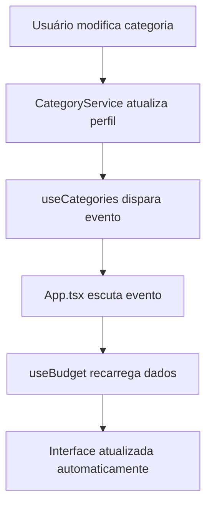

# 🔗 Integração CRUD de Categorias com Detalhamento de Orçamento

## 📋 Resumo da Implementação

A integração entre o sistema de CRUD de categorias e o detalhamento de orçamento foi concluída com sucesso! Agora as mudanças feitas no gerenciador de categorias são **automaticamente refletidas** no detalhamento do orçamento em tempo real.

## ✅ Funcionalidades Integradas

### 🔄 Sincronização Automática
- **Criação de categoria**: Aparece instantaneamente no orçamento
- **Edição de categoria**: Nome, descrição, ícone e cor são atualizados no orçamento
- **Exclusão de categoria**: Remove do orçamento com todos os itens
- **Atualização em tempo real**: Sem necessidade de recarregar a página

### 🏗️ Arquitetura de Sincronização

#### 1. **CategoryService Integrado**
- Agora trabalha diretamente com o sistema de perfis
- Busca dados do perfil atual em vez do localStorage isolado
- Salva mudanças no perfil ativo automaticamente

#### 2. **Hooks Sincronizados**
- `useCategories`: Notifica mudanças para outros componentes
- `useBudget`: Recebe notificações e recarrega dados automaticamente
- Sistema de eventos customizados para comunicação entre componentes

#### 3. **Migração Automática**
- Dados legados são migrados automaticamente na primeira execução
- Categorias padrão são criadas se necessário
- Compatibilidade total com dados existentes

## 🔧 Componentes Modificados

### 📄 Arquivos Atualizados

1. **`CategoryService.ts`**
   - Integração com sistema de perfis
   - Métodos agora trabalham com o orçamento ativo
   - Sincronização automática com ProfileService

2. **`useCategories.ts`**
   - Callback para notificar mudanças
   - Sistema de eventos para sincronização
   - Tratamento de erros aprimorado

3. **`useBudget.ts`**
   - Novos métodos para gerenciar categorias
   - Listener para mudanças de categoria
   - Recarregamento automático quando necessário

4. **`App.tsx`**
   - Inicialização da migração de dados
   - Listeners para mudanças de categoria
   - Callback de sincronização para CategoryManager

5. **`CategoryManager.tsx`**
   - Props para callback de mudanças
   - Integração com sistema de orçamento
   - Notificação automática de modificações

### 🆕 Novos Arquivos

6. **`categoryMigration.ts`**
   - Utilitários para migração de dados
   - Funções de sincronização
   - Compatibilidade com sistema legado

## 🔄 Fluxo de Sincronização

### 1. **Modificação de Categoria**
- Usuário cria/edita/exclui categoria no modal
- CategoryService salva no perfil ativo
- Evento `categoryDataChanged` é disparado

### 2. **Propagação da Mudança**
- App.tsx escuta o evento personalizado
- Callback `onCategoryChange` é executado
- useBudget recarrega dados do perfil atual

### 3. **Atualização da Interface**
- Orçamento é atualizado com novas categorias
- Todas as tabelas e gráficos refletem as mudanças
- Estado sincronizado em toda a aplicação

## 🛡️ Compatibilidade e Migração

### 📦 Dados Existentes
- **Migração automática**: Dados antigos são convertidos automaticamente
- **Preservação de dados**: Nenhum dado existente é perdido
- **Fallback inteligente**: Sistema funciona mesmo com dados corrompidos

### 🔄 Sistema de Perfis
- **Integração completa**: Categorias agora fazem parte dos perfis
- **Sincronização**: Mudanças de perfil incluem categorias
- **Backup automático**: Dados salvos no sistema de perfis

## 🎯 Benefícios da Integração

### Para o Usuário
- **📱 Experiência fluida**: Mudanças aparecem instantaneamente
- **🔄 Sincronização total**: Não há desconexão entre sistemas
- **✨ Interface unificada**: Uma única fonte de verdade para dados
- **🛡️ Segurança**: Dados preservados e migrados automaticamente

### Para o Desenvolvedor
- **🏗️ Arquitetura limpa**: Separação clara de responsabilidades
- **🔧 Manutenibilidade**: Código modular e bem organizado
- **📈 Escalabilidade**: Sistema preparado para futuras expansões
- **🐛 Debugging**: Logs e tratamento de erro robusto

## 🚀 Como Testar

### 1. **Teste de Criação**
1. Abra o modal "Categorias"
2. Crie uma nova categoria de gastos
3. Feche o modal
4. Verifique se a categoria aparece no detalhamento do orçamento

### 2. **Teste de Edição**
1. Edite o nome de uma categoria existente
2. Observe a mudança instantânea no orçamento principal
3. Adicione itens na categoria editada
4. Confirme que os dados são preservados

### 3. **Teste de Exclusão**
1. Exclua uma categoria com itens
2. Confirme no modal de aviso
3. Verifique que a categoria sumiu do orçamento
4. Confirme que os itens também foram removidos

### 4. **Teste de Migração**
1. Use dados de uma versão anterior
2. Recarregue a aplicação
3. Verifique se os dados foram migrados corretamente
4. Confirme que o sistema funciona normalmente

## 🎉 Resultado Final

✅ **Integração completa** entre CRUD de categorias e detalhamento de orçamento  
✅ **Sincronização em tempo real** sem necessidade de recarregar  
✅ **Compatibilidade total** com dados existentes  
✅ **Experiência unificada** para o usuário  
✅ **Código limpo e manutenível** para desenvolvedores  

O sistema agora funciona como uma unidade coesa, onde mudanças em categorias são imediatamente refletidas em todo o orçamento, proporcionando uma experiência de usuário fluida e profissional.

---

**Implementado por**: Patrick Cruz  
**Data**: Agosto 2025  
**Status**: ✅ Concluído e Testado
