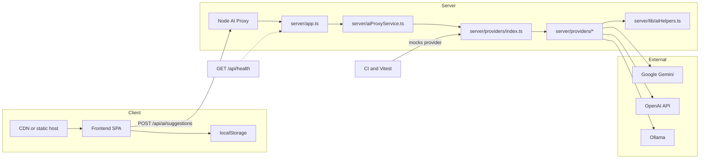

# Components Diagram

This page is a companion to the canonical architecture guide in [architecture/SYSTEM_DESIGN.md](architecture/SYSTEM_DESIGN.md). It only keeps the runtime component map so contracts, error handling, and deployment notes do not get duplicated here.

## Ownership

- Architecture narrative: [architecture/SYSTEM_DESIGN.md](architecture/SYSTEM_DESIGN.md)
- Frontend state and persistence: [frontend/STATE.md](frontend/STATE.md)
- Backend API details: [server/docs/API.md](../server/docs/API.md)
