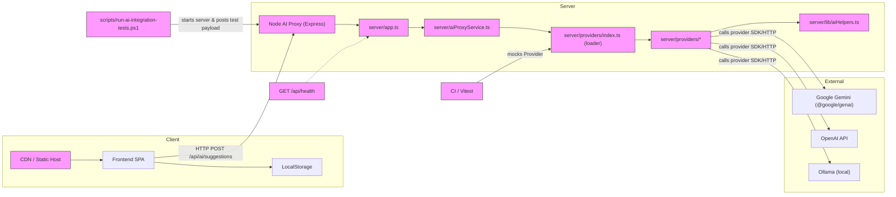

# Components Diagram — Family Budget App

This diagram shows the main runtime components and how they interact.

Notes:

- The SPA owns local persistence (`localStorage`) and constructs the sanitized `BudgetSummary` payload.
- The Node AI Proxy centralizes provider keys and delegates to provider adapters via the loader.
- Providers are pluggable; `AI_PROVIDER` selects the active adapter. CI and tests mock adapters to avoid network.
- `server/lib/aiHelpers.ts` contains shared prompt-building and normalization logic.

