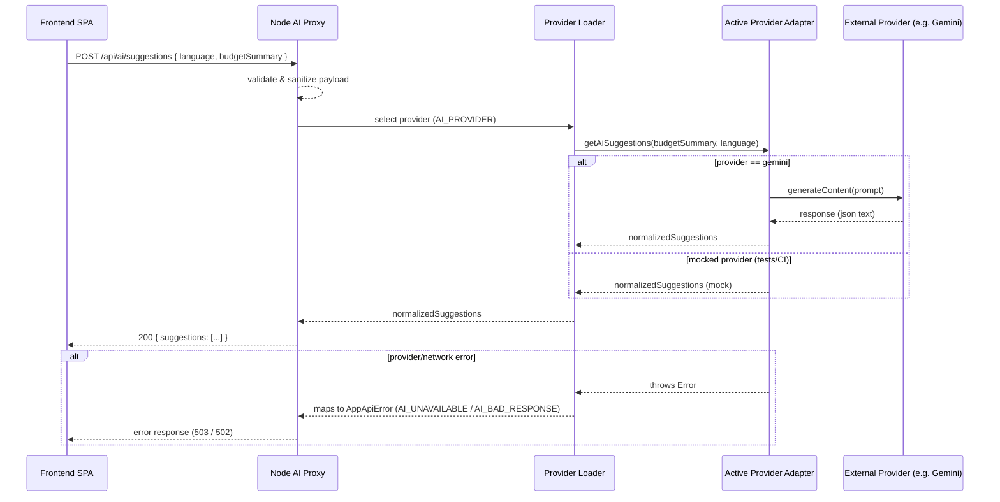

# System Design — Family Budget App

This document describes the architecture, runtime flows, and deployment considerations for Family Budget App. It includes diagrams for request flows, provider pluggability, error handling, and security notes.

## Overview

- Frontend: React + TypeScript (Vite) SPA — owns the domain model and UI state in `localStorage` (profiles, budgets, categories, saved suggestions).
- Backend: Minimal Node/Express AI proxy (in `server/`) — receives sanitized budget summaries and returns normalized AI suggestions. The backend keeps provider API keys and runs provider adapters.
- Testing: Vitest for unit and integration tests. Integration tests mock providers to stay deterministic in CI.

## Components

- SPA (client)
  - Builds a sanitized `BudgetSummary` and calls `POST /api/ai/suggestions`.
  - Handles UI, local persistence, and fallback when AI is unavailable.

- AI Proxy (server)
  - `server/app.ts` — Express routes and middleware (validation, JSON parsing, raw-body capture when needed).
  - `server/aiProxyService.ts` — validation and high-level orchestration that delegates to provider loader.
  - `server/providers/*` — provider adapters (Gemini, future OpenAI/Ollama). Each adapter exports `getAiSuggestions(budgetSummary, language)`.
  - `server/lib/aiHelpers.ts` — shared prompt builders, validators, normalization helpers, and `AppApiError`.

- Providers
  - External AI provider (Gemini) invoked server-side via `@google/genai` or an HTTP client.
  - Providers must return normalized suggestions or throw `AppApiError` for expected failures.

## Key Flows

### AI Suggestion Request (Sequence)



### Provider Selection

- `AI_PROVIDER` environment variable controls which adapter loads. Default: `gemini`.
- Adapters are dynamically imported by `server/providers/index.ts` to allow ESM-friendly loading and easier test mocking.

## Error Handling

- Input validation failures return `AI_BAD_REQUEST` (400).
- Provider misconfiguration returns `AI_MISCONFIGURED` (500).
- External provider failures are mapped to `AI_UNAVAILABLE` (503) or `AI_BAD_RESPONSE` (502) depending on pattern matching.
- Clients should treat non-2xx responses as transient and fall back to `geminiServiceMock` or display a graceful message.

## Deployment & Security

- Frontend can be served from static hosting (CDN). Backend proxy must run where `GEMINI_API_KEY` is secure (server environment or secrets store).
- For full AI-enabled deployment, ensure both the frontend build and the AI proxy are deployed and that `GEMINI_API_KEY` is set in the backend.
- Use HTTPS for backend communication in production.

## Local Development

- Run both processes for the full developer experience:

```powershell
npm install
npm run dev:full
```

- For provider-adapter testing, set `AI_PROVIDER` locally and run `npm run dev:server`.

## Observability & Debugging

- Health check: `GET /api/health` — verifies server is up.
- During raw-body debugging (PowerShell `curl.exe` issues), prefer `Invoke-RestMethod` or post a JSON file to avoid quoting issues.
- Integration tests exercise request-level behavior while mocking external providers.

## Extending the System

- Add new providers by creating `server/providers/<name>.ts` following the adapter skeleton and adding tests.
- Keep normalization logic in `server/lib/aiHelpers.ts` when shared across adapters.

## References

- Provider guide: `server/docs/provider-guide.md`
- Integration docs: `server/docs/integration.md`
- AI proxy code: `server/aiProxyService.ts`, `server/app.ts`, `server/providers/`
