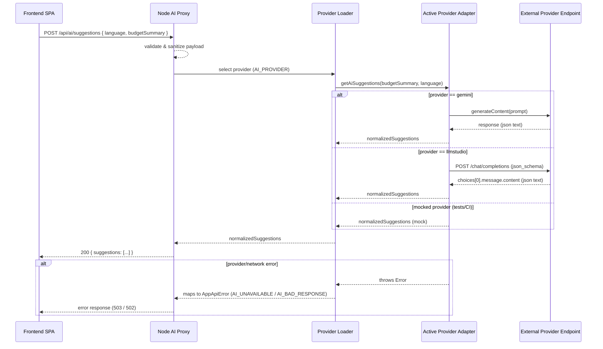
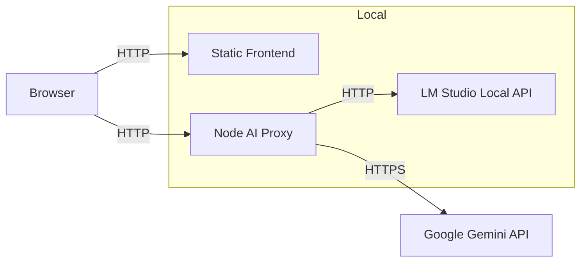
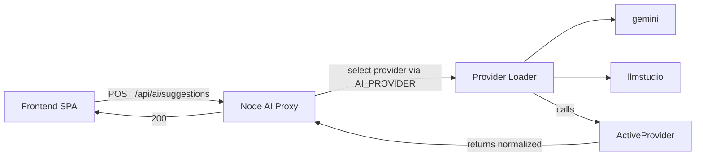

# Mermaid Diagrams

Below are diagrams describing the high-level request flow and interactions. Use any Mermaid renderer (or VS Code extension) to preview.

## AI Proxy Sequence

## Deployment Context

Feel free to extract these blocks into `.mmd` files for rendering elsewhere.

## Provider pluggability (mermaid)

Use this diagram to reason about adding adapters under `server/providers/` and to illustrate provider failover and mocking in tests.
